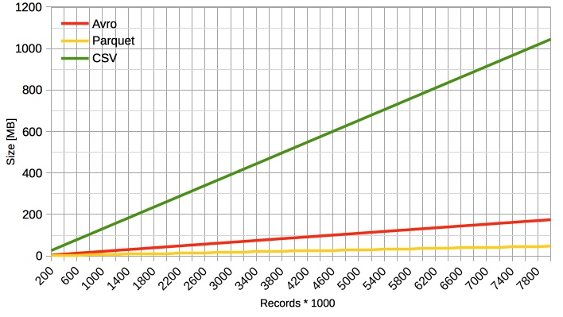
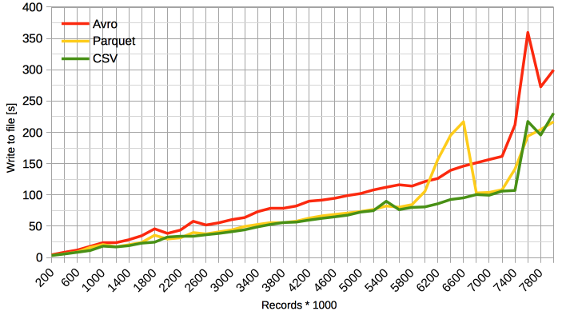
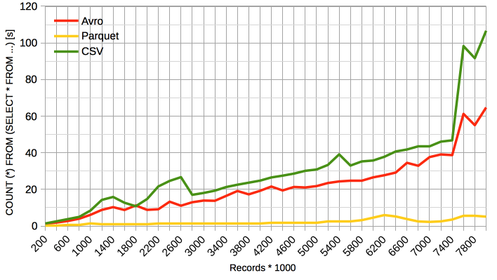
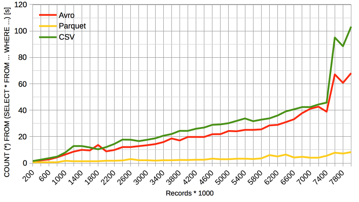
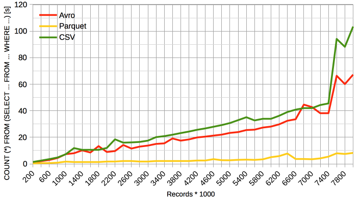

# Benchmark various serializers used in the HDFS ecosystem

## Introduction

For now this is mainly focusing on CSV vs Avro vs Parquet.

Implemented benchmarks:
 - bulk write
 - bulk read/count
 - filtered read, all columns
 - filtered read, some columns
 
The seed (sample) data used for benchmarking is a subset of the KDD data set, containing 49402 lines of 42 columns containing strings, and numbers.

Both Parquet and Avro serializers have the `compression.codec` set to `snappy`.
Every iteration was ran 3 times and the results were averaged to "hammer down" the incidental spikes.


## Results on Yarn

### Configuration
The Yarn cluster configuration used consisted of 3 executors with 3 GB RAM each, and a driver having 5 GB of RAM, on top of a 3 nodes HDFS cluster.

### Results

The raw results file can be found [here](docs/yarn-results.md).

#### Generated File Size



#### Write Time



#### Bulk Red Time



```scala
    dataFrameReader.load(outputFileName).
    count
```

#### Filtered Results Read Time



```scala
dataFrameReader.load(outputFileName).
    filter("C41 = 'pod.' AND C7 = 1 AND C8 = 0 AND C31 < 100 AND C35 > 0.1 AND C35 < 0.5").
    count
```

#### Selected Columns Filtered Results Read Time



```scala
dataFrameReader.load(outputFileName).
    select("C1", "C2", "C3", "C7", "C8", "C31", "C35", "C41").
    filter("C41 = 'pod.' AND C7 = 1 AND C8 = 0 AND C31 < 100 AND C35 > 0.1 AND C35 < 0.5").
    count
```

## Conclusions

All the data points to the fact that Parquet is yielding the smallest file size and the fastest read and write times.

**Note**: The Parquet write spike around 6600000 records is not accounted for.

**Note**: The Avro and CSV read spikes around 7400000 records is not accounted for.

## External references

[Choosing an HDFS data storage format- Avro vs. Parquet and more - StampedeCon 2015](http://www.slideshare.net/StampedeCon/choosing-an-hdfs-data-storage-format-avro-vs-parquet-and-more-stampedecon-2015); corresponding code available [here](https://github.com/silicon-valley-data-science/stampedecon-2015).

## TODOs
- [ ] Refactor the HDFS Benchmark (code beautification)
- [ ] Add synthetic data generator for arbitrary sizes (both rows and columns)
- [ ] Add synthetic data generator for arbitrary data types (strings, numbers, booleans, structures...)
- [ ] Extract the tested query as an external parameter
- [ ] Improve the report details
